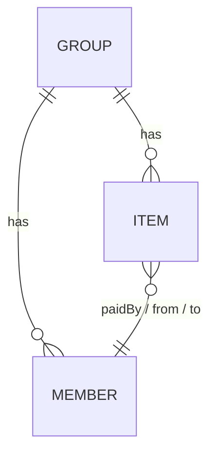
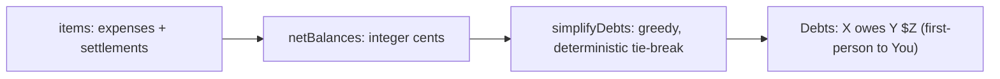

# Split — Implementation Plan

**Date:** 2026-06-26
**Type:** feat
**Status:** active
**Origin:** docs/requirements.md
**Depth:** Standard. Right-sized for a build-day demo, not production.

> **Reading this as a participant?** This is the kind of plan Claude writes for itself to build from, so it gets technical in places. You don't need to understand every line to follow the walkthrough. The Step 2 prompt produces a simpler plan than this one, which is normal. This is a mature version, kept here so you can see where the process can lead.

## Summary

Build "Split", a localStorage-only group expense tracker, matching the
claude.ai/design handoff in `design_handoff_split_app/` pixel-for-pixel. The plan
covers the data model and persistence, the five-screen structure, the split
calculation (cent-rounding that sums exactly to the total), and the
balance/debt-simplification logic (greedily reduce settle-up transactions).

The build ships the **core loop** (groups list → create group → add expense →
balances); settle-up is fully designed (and coded in the handoff) but its screen
is deferred in the build.

Stack: Next.js 16 (App Router), React 19, Tailwind v4, TypeScript. Design tokens
live in `src/app/globals.css` and mirror both `design-system/` and the handoff's
`src/tokens.ts`.

> **Next.js 16 caveat (AGENTS.md):** not the Next.js in your training data. Read
> `node_modules/next/dist/docs/` before route/layout code. Every screen is a
> client component (`'use client'`); client components still server-render on
> first request, so localStorage must be guarded; dynamic-route `params` is a
> Promise (unwrap with `use()` / `useParams()`).

---

## Design handoff reconciliation (read this first)

The handoff in `design_handoff_split_app/` is the **visual and interaction source
of truth**. It is a Vite + React 18 reference; we port it to Next 16 + React 19.

**Adopt from the handoff:**
- All five screens, layout, tokens, copy, component breakdown (its `src/components/`
  tree maps 1:1 to ours). Recreate the UI exactly.
- The **"You" current-user model** (`CURRENT_USER = 'You'`): every group includes a
  non-removable "You" member; balances and copy are first-person ("Priya owes you
  $160", "you lent $X"). The design's first-person framing is clearer, so we use it.
- The **unified activity model**: one `items` array per group holding `expense` and
  `settle` entries (not separate arrays). Settlements live in the same feed.
- The store/intent-method architecture and the pure-logic isolation.

**Do NOT adopt from the handoff:**
- **`src/lib/balances.ts`'s money math.** It uses dollar **floats**
  (`amount / split.length`) and rounds each member's net independently, so
  balances do not sum to zero. Concretely, $10 paid by You split 3 ways yields
  You +6.67, Priya −3.33, Sam −3.33 → **+0.01**, a ghost cent — exactly the bug
  the plan review caught and the try-it test is built to expose. **Keep this
  plan's integer-cents `splitEqual`/`netBalances` instead** (U2/U3). Port the
  handoff's *shape* (function names, return types, the `colorForName`/`formatMoney`
  helpers), not its float arithmetic. `formatMoney` becomes `formatCents`.
- Its `simplifyDebts` float epsilon (`0.005`) and missing tie-break — both vanish
  on integer cents; use the deterministic tie-break from U3.

---

## Problem Frame

One person ("You") tracks shared expenses across groups of named members (no
accounts, no backend). The hard parts are the two money rules:

- **Cent-rounding:** equal splits that don't divide evenly must still sum to the
  exact total — including the dollars→cents parse at the input boundary.
- **Debt simplification:** raw pairwise debts netted to few transactions, with
  deterministic, reproducible output.

Everything else (screens, navigation, persistence) is conventional and exists to
give the two money rules a real surface. First-person framing is anchored to the
"You" member that every group contains.

---

## Requirements Traceability

Carried from docs/requirements.md, reconciled with the design:

- **R1 — Journeys:** create group, log expense, settle up (settle-up screen
  deferred build; its data path is live).
- **R2 — Rounding:** integer cents; dollars→cents parse via `Math.round`; base =
  `floor(total/n)`; remainder spread one cent at a time to the first participants
  **in member order**; shares sum exactly to total; deterministic across reloads.
- **R3 — Debt simplification:** net balances, greedy largest-debtor/creditor match
  with a deterministic tie-break; reduce transaction count; balances sum to zero.
- **R4 — Equal splits only** (the "by shares"/"exact" segmented options exist in
  the design but are not wired — deferred).
- **R5 — Full settle only**; settle-up *screen* deferred; when built it is
  idempotent (clamp to outstanding amount). The `settle` item type ships now.
- **R6 — Persistence:** all data survives reload via localStorage (key
  `split:v1`); corrupt/absent storage falls back to empty, never crashes;
  storage access is SSR-guarded.
- **R7 — Edge cases:** 0/1-member groups, split among nobody, invalid amount,
  payer not in split, all-settled empty state, group-not-found, idempotent settle.
- **R8 (new) — "You" model:** every group includes a non-removable `You` member;
  balances and feed copy are first-person relative to `You`.

---

## Key Technical Decisions

- **Money is integer cents everywhere.** Floats only at the input parse and
  display format, both owned by `src/lib/money.ts`. Parse is
  `Math.round(parseFloat(v) * 100)` guarded by `/^\d+(\.\d{1,2})?$/`. This is the
  explicit fix for the handoff's float bug.
- **"You" current user** in `src/config.ts` (`CURRENT_USER = 'You'`), mirroring
  the handoff. Group creation seeds a `You` member that can't be removed.
- **Unified `items` model** per group (expense | settle), per the handoff — the
  Activity feed and `netBalances` both read it; no separate settlements array.
- **Single localStorage key, whole-state read/write, SSR-guarded.** `split:v1`
  holds `{ version, groups }`; `load()` returns empty when
  `typeof window === 'undefined'` or on corrupt JSON.
- **Shared store via a fresh-on-mount hook/Context.** Port the handoff's
  `SplitContext` intent-method store to a Next client Context in `layout.tsx`, read
  after a `mounted` flag so the server pass renders a neutral shell (no hydration
  mismatch) and every navigation sees fresh data.
- **Pure, dependency-free calc** in `src/lib/split.ts` and `src/lib/balances.ts`
  (integer cents). Port `colorForName`/`formatCents`/`initial` shapes from the
  handoff; reimplement the arithmetic.
- **Vitest** as runner (U0) — the test spine the handoff lacks, and what catches
  the float bug.
- **IDs via `genId()`** (not bare `crypto.randomUUID()` — throws over LAN).
- Dynamic-route `params` unwrapped via `use()`; tabs via client state.

---

## Data Model

Adopt the handoff's shapes, with money as integer cents (`amountCents`, not float
`amount`).

- **Member** — `{ name, color }`. `color` from `colorForName(name)`; `You` is brand
  indigo. Member order is significant (drives deterministic rounding + tie-break).
- **ActivityItem** — union:
  - expense: `{ id, type:'expense', desc, amountCents, paidBy, split: string[], ts }`
  - settle: `{ id, type:'settle', from, to, amountCents, ts }`
- **Group** — `{ id, name, icon:[from,to], members: Member[], items: ActivityItem[] }`.
  `createGroup` always includes a `You` member.
- **Debt** — `{ from, to, amountCents }` (derived, never stored).

Persisted root: `{ version: 1, groups: Group[] }` under `split:v1`.

---

## Screen / Route Structure (App Router)

Matches the handoff's five screens. All client components; dynamic routes unwrap
`params` via `use()`.

| # | Screen | Route | File | Handoff component | Build |
|---|--------|-------|------|-------------------|-------|
| 1 | Groups (home) | `/` | `src/app/page.tsx` | `groups/GroupsScreen` (+ `OverallSummary`, `GroupRow`) | Core |
| 2 | Create group | `/groups/new` | `src/app/groups/new/page.tsx` | `create/CreateGroupScreen` | Core |
| 3 | Group detail (Balances/Activity) | `/groups/[id]` | `src/app/groups/[id]/page.tsx` | `detail/GroupDetailScreen` (+ `BalanceHero`, `SettleRow`, `ActivityRow`) | Core |
| 4 | Add expense | `/groups/[id]/expenses/new` | `src/app/groups/[id]/expenses/new/page.tsx` | `expense/AddExpenseScreen` (+ `AmountField`, `PayerPicker`, `SplitSelector`) | Core |
| 5 | Settle up | `/groups/[id]/settle` | `src/app/groups/[id]/settle/page.tsx` | `settle/SettleUpScreen` | **Deferred** |

Primitives to port: `Avatar`, `Button`, `Money`, `Fab`, `EmptyState`, `Tabs`,
`ScreenHeader` (handoff `components/primitives/`). Home shows an **overall hero**
(net across all groups) per the design.

**Group-not-found:** any `[id]` page that can't resolve the id renders a
not-found state or redirects to `/`.

**Settle entry point in the core build:** a disabled `<button>` (not a `<Link>`),
so the deferred `/settle` route is never navigated to.

---

## Split Calculation Logic (R2) — integer cents, keep over the handoff

`src/lib/money.ts`:
- `parseDollarsToCents(input): number` — validate `/^\d+(\.\d{1,2})?$/`, then
  `Math.round(parseFloat(input) * 100)`. `Math.round` is mandatory
  (`19.99*100 = 1998.999…`).
- `formatCents(cents, currency='$'): string` — `Math.abs`-based (sign conveyed by
  colour, per the design), two decimals, `tabular-nums`. Replaces the handoff's
  `formatMoney`.

`src/lib/split.ts` — `splitEqual(totalCents, participantNames, memberOrder)`:
1. Guard non-empty participants (**throw** on empty), `totalCents >= 0`.
2. Normalise participants to canonical member order (stable remainder).
3. `base = floor(total/n)`; `remainder = total − base*n` (0..n−1).
4. `base` to all; +1 cent to the first `remainder` participants in member order.
5. Postcondition (assert + test): shares sum exactly to `totalCents`.

Worked: `splitEqual(1000,[You,Priya,Sam])` → `{You:334,Priya:333,Sam:333}` = 1000.

---

## Balance & Debt-Simplification Logic (R3) — integer cents, keep over the handoff

`src/lib/balances.ts`, pure, over `group.members` (assert referenced names
resolve):

**`netBalances(group): Record<name, cents>`**
- Init every member at 0.
- expense item: credit `paidBy` by `amountCents`; debit each `split` member their
  `splitEqual` share (integer cents — this is what keeps the sum at 0, unlike the
  handoff's `amount/length`).
- settle item: credit `from`, debit `to` by `amountCents`.
- Postcondition (assert + test): net balances sum to 0.

**`simplifyDebts(net, memberOrder): Debt[]`** — greedy largest-debtor/creditor;
deterministic tie-break by member order; integer cents (no float epsilon). "Few"
transactions, not guaranteed "fewest" (NP-hard). A→B→C nets to A→C.

**Provenance tradeoff (surface in Balances copy):** simplification can suggest a
transfer between two people who never shared an expense. Accepted; the Activity
feed is the record of what happened.

---

## Implementation Units

### U0. Project prerequisites (test runner + scaffold cleanup)
- **Goal:** Make the test spine executable; reconcile the scaffold.
- **Dependencies:** none.
- **Files:** `package.json`, `tsconfig.json`, `vitest.config.ts` (if needed),
  `src/app/layout.tsx`.
- **Approach:** Add Vitest (`npm i -D vitest`), `"test": "vitest run"`,
  `vitest/globals` in tsconfig. Switch the layout to **Inter** (matches tokens and
  the handoff) wired to `--font-sans`; avoid a build-time Google-font fetch; fix the
  stale `title: "Create Next App"` metadata.
- **Test scenarios:** `Test expectation: none -- tooling. Validate by `npm run test` running and `npm run dev` serving with Inter.`
- **Verification:** `npm run test` executes; Inter applied; no build-time font fetch.

### U1. Types + config + localStorage store
- **Goal:** Domain types, the "You" config, and an SSR-safe store with a seed.
- **Requirements:** R6, R8.
- **Dependencies:** U0.
- **Files:** `src/lib/types.ts`, `src/config.ts`, `src/lib/store.ts`,
  `src/lib/store.test.ts`. (`design_handoff_split_app/src/state/seed.ts` is reference
  data only; the app starts empty so the walkthrough's try-it step begins from a clean slate.)
- **Approach:** Port handoff `types.ts` but money as `amountCents`. `config.ts`
  exports `CURRENT_USER='You'`, `DEFAULT_CURRENCY`, `EVEN_SPLIT_PRESELECT`,
  `SHOW_YOU_CONTEXT`. Store: `load()`/`save()`/intent mutators; `load()` returns
  empty when `typeof window==='undefined'` or on corrupt
  JSON. `createGroup` always seeds a non-removable `You`. `genId()` with fallback.
  Validate that `paidBy`/`from`/`to`/`split` names ∈ `group.members`; store `split`
  in member order.
- **Test scenarios:**
  - Round-trip save/load a group with items.
  - `load()` with no `window` / no key / malformed JSON → empty, no throw.
  - `createGroup` always includes `You`, non-removable.
  - Adding an item with a name not in the group is rejected.
  - Covers R6, R7, R8.
- **Verification:** store tests pass; no React imports; SSR-guard test green.

### U2. Money helpers + equal-split calculation
- **Goal:** `parseDollarsToCents`, `formatCents`, `splitEqual` (integer cents).
- **Requirements:** R2, R4.
- **Dependencies:** U1.
- **Files:** `src/lib/money.ts`, `src/lib/money.test.ts`, `src/lib/split.ts`,
  `src/lib/split.test.ts`.
- **Approach:** As in *Split Calculation Logic*. Do **not** copy the handoff's
  `amount/length`; reimplement on integer cents.
- **Test scenarios:**
  - `parseDollarsToCents`: `"19.99"→1999`, `"3.30"→330`, `"0.07"→7`; rejects `""`,
    `"abc"`, `"1.234"`, `"-5"`.
  - `formatCents(1999)→"$19.99"`, `formatCents(-4000)→"$40.00"` (abs).
  - `splitEqual`: `1000/3 → [334,333,333]`; `n=1` full; `total=0` zeros; empty
    throws; remainder owner stable regardless of input order.
  - Property: shares always sum to total, differ ≤1 cent.
  - **Regression test for the handoff bug:** $10 split 3 ways → balances built
    from these shares sum to exactly 0 (no ghost cent).
  - Covers R2.
- **Verification:** money + split tests pass incl. the sum-exactly property.

### U3. Balances + debt simplification
- **Goal:** `netBalances` + `simplifyDebts` (integer cents, deterministic).
- **Requirements:** R3.
- **Dependencies:** U2.
- **Files:** `src/lib/balances.ts`, `src/lib/balances.test.ts`. Port
  `colorForName`/`initial` from the handoff here or in a small `src/lib/avatar.ts`.
- **Approach:** As in *Balance & Debt-Simplification Logic*. Over `group.members`;
  assert name resolution; tie-break by member order.
- **Test scenarios:**
  - **Byron seed:** Airbnb $300 (You), Petrol $60 (Sam), Dinner $120 (You), split
    3 ways → You +260, Priya −160, Sam −100 → "Priya owes you $160", "Sam owes you
    $100".
  - Netting: A owes B $10, B owes C $10 → single A→C $10.
  - $10/3 → net sums to **exactly 0** (the handoff-bug regression at balance level).
  - Tie-break: two equal creditors + two equal debtors → reproducible transfers.
  - All zero → no debts; payer-not-in-split allowed; settle item clears a debt.
  - Covers R3.
- **Verification:** balance tests pass; net sums to 0 across cases; transfers stable.

### U4. Groups home + shared store hook
- **Goal:** Home (overall hero + group list + FAB, empty state) and the
  fresh-on-mount store/Context all screens consume.
- **Requirements:** R1, R6, R8.
- **Dependencies:** U1, U3.
- **Files:** `src/app/page.tsx`, `src/state/SplitContext.tsx` (ported),
  `src/components/groups/*`, `src/components/primitives/*`.
- **Approach:** Port `SplitContext` to a Next client Context (mounted-gated read).
  `OverallSummary` = net across all groups (first-person). `GroupRow` = tile +
  name + meta + first-person balance tag (green/red/grey). `EmptyState` + `Fab`.
- **Patterns to follow:** the handoff components + `design-system/` cards.
- **Test scenarios:** empty state renders; populated rows show correct first-person
  summaries; back-navigation after add shows fresh data (covered by the try-it walk).
- **Verification:** both states render; summaries match `simplifyDebts`; reload + nav persist.

### U5. Create group screen
- **Goal:** Name + inline add-members (You preset, non-removable), land in new group.
- **Requirements:** R1, R7, R8.
- **Dependencies:** U1, U4.
- **Files:** `src/app/groups/new/page.tsx`, `src/components/create/*`.
- **Approach:** Port `CreateGroupScreen` + `MemberRow`. `You` chip shows muted
  "you", no ×; others removable; Enter adds; duplicates/blank ignored. Sticky CTA
  disabled until name non-empty **and** ≥2 members. On create → new group's
  Activity tab.
- **Test scenarios:** name + members → created with `You` included; empty name or
  <2 members → CTA disabled; the try-it walk for integration. Covers R1, R8.
- **Verification:** created group in store and on home.

### U6. Add expense screen
- **Goal:** Fast expense entry (amount, payer, even split).
- **Requirements:** R1, R2, R4, R7.
- **Dependencies:** U1, U2, U5.
- **Files:** `src/app/groups/[id]/expenses/new/page.tsx`, `src/components/expense/*`.
- **Approach:** Unwrap `params` via `use()`. Port `AmountField` (hero input,
  `inputMode="decimal"`, $ chips), `PayerPicker` (single-select, default You),
  `SplitSelector` (everyone pre-ticked per `EVEN_SPLIT_PRESELECT`, live per-person
  share via `splitEqual`). Parse with `parseDollarsToCents`; persist `split` in
  member order. Save disabled until amount>0 and ≥1 split member; block if <2
  members; group-not-found → redirect.
- **Test scenarios:** $120 by You split all → correct cents + shares; amount
  0/neg/non-numeric/>2dp blocked; no split blocked; payer-not-in-split allowed;
  bad id → redirect. Covers R2, R7.
- **Verification:** saved expense → correct shares (U2) and balances (U3).

### U7. Group detail — Balances + Activity tabs
- **Goal:** Two-tab detail (Balances + Activity), first-person.
- **Requirements:** R1, R3, R7, R8.
- **Dependencies:** U1, U3, U6.
- **Files:** `src/app/groups/[id]/page.tsx`, `src/components/detail/*`.
- **Approach:** Unwrap `params`; resolve group or not-found. Header with member
  avatar stack. `Tabs` client state. **Balances:** `BalanceHero` (first-person net)
  + "Who owes whom" `SettleRow`s (directional, brand "Settle" pill → disabled stub
  in core build); all-settled → 🎉 empty state. **Activity:** `ActivityRow`s
  newest-first; expense rows show payer/`split N ways`/optional `you lent`/`you
  borrowed` line (per `SHOW_YOU_CONTEXT`) + `formatCents`; settle rows show ✓.
- **Test scenarios:** Balances matches `simplifyDebts`; Activity reverse-chron;
  all-settled empty state; empty group empty state; bad id → redirect. Covers R1, R3.
- **Verification:** both tabs correct; reload + back-nav persist.

---

## Build Order

**Core loop (build now):** U0 → U1 → U2 → U3 → U4 → U5 → U6 → U7. Prereqs + logic
libs first (money rules unit-tested before UI), then the journey screens.

**Deferred build:**

### U8. Settle up screen *(deferred — designed and coded in the handoff)*
- **Goal:** Confirm a full payment; balance clears, idempotently.
- **Requirements:** R5.
- **Files:** `src/app/groups/[id]/settle/page.tsx`, `src/components/settle/*`.
- **Approach:** Port `SettleUpScreen` (two avatars + →, directional headline,
  before/after card). Writes a `settle` item (model already supports it).
  **Idempotent:** clamp to the current outstanding amount, no-op if zero. In the
  core build, the Settle entry point is a disabled button.

---

## Scope Boundaries

**In scope:** U0–U7 plus the two money rules, the "You" model, persistence, edge
cases. The `settle` item type ships (model), the settle *screen* doesn't.

**Deferred to follow-up:** U8 settle-up screen; non-even split methods (shares/
exact — present in the design, unwired); edit/delete; cross-tab sync.

**Outside this product:** accounts/login/multi-user/sync; multiple currencies;
categories, receipts, export, notifications.

---

## Risks & Mitigations

- **Porting the handoff's float `balances.ts` reintroduces the ghost-cent bug.**
  *Mitigation:* explicit "do NOT adopt" note above; integer-cents U2/U3; the
  $10/3 regression test; assert net-sums-to-zero.
- **Rounding leak incl. dollars→cents parse.** *Mitigation:* `Math.round` parse +
  regex; sum-exactly property test.
- **localStorage on SSR / hydration mismatch.** *Mitigation:* `typeof window`
  guard; `mounted`-gated read.
- **`params` Promise in Next 16.** *Mitigation:* `use()`/`useParams()` in `[id]` pages.
- **Stale UI across screens.** *Mitigation:* fresh-on-mount Context.
- **Stack port (Vite/React18 → Next16/React19).** *Mitigation:* port components,
  don't copy wholesale; pure logic (types) ports clean, money logic reimplemented.
- **No test runner.** *Mitigation:* Vitest in U0.
- **Debt-netting non-determinism / over-claim.** *Mitigation:* member-order
  tie-break; "few" not "fewest".
- **Empty participants / stale names break zero-sum.** *Mitigation:* `splitEqual`
  throws; name validation in store + `netBalances`.
- **`crypto.randomUUID` over LAN.** *Mitigation:* `genId()` fallback.
- **Group-not-found.** *Mitigation:* resolve-or-redirect in `[id]` pages.

---

## Verification Strategy

- Unit tests for U2–U3 (money, split, balances) are the spine — green before UI.
  The **$10/3 regression test** is the explicit guard against the handoff's float
  bug.
- Browser try-it walk: create a group (with You), add the $120 even split and the
  $10/3 case, confirm shares sum to $10.00 and which member absorbs the cent,
  confirm netting collapses redundant debts (A→C), confirm reload **and**
  back-navigation persist/refresh, and visually diff against the handoff prototype
  (`design_handoff_split_app/reference/Split.dc.html`).
